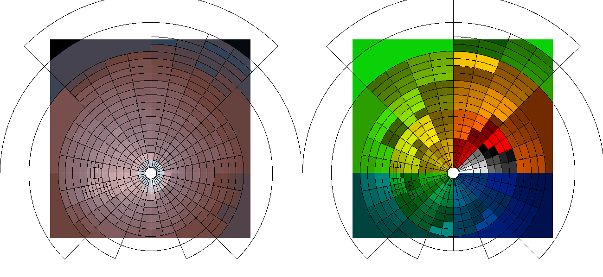
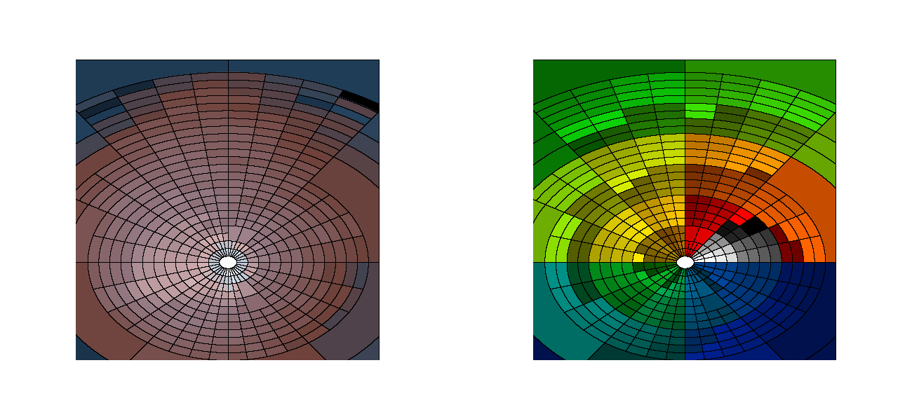
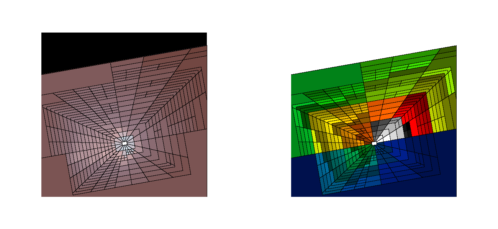
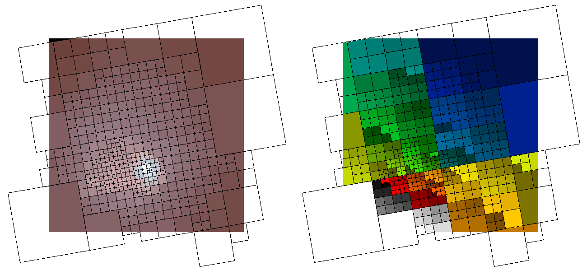

# `dmradar`

This is the polar equivalent of the CIAO 
[`dmnautilus`](https://cxc.cfa.harvard.edu/ciao/ahelp/dmnautilus.html) 
tool.

It works by subdividing the image into 4 pie-shaped wedges and checking
if the SNR in each wedge meets the threshold criteria.  If so, then each wedge
is divided in 4 (radii by 2, angle divided by 2) and the process is repeated.

By default, the wedges are circular: `pie` shapes.  Users can also
use elliptical wedges, `epanda` , or box wedges, `bpanda`.  There is also
a `box` mode which emulates the behavior of the original `dmnautilus` tool.


> **Where does `*panda` come from?**
> 
> `panda` is from `SAOImage ds9`.  It means: _pie and annulus_.


## Installation Instructions

Users must have CIAO installed and have sourced the appropriate 
ciao setup script for their environment (eg `bash`|`tcsh` and `conda`|`ciao-install`).
Users do not need to have the ciao source code installed.

For internal CXC users, they can use the `Makefile.cxc` for example in 
their views. Make sure that you have built `src/da/analysis/dmtools/dmimgio` first.

```bash
cd /tmp
git clone https://github.com/kglotfelty/dmradar
cd dmradar

mkdir -p .../src/da/analysis/dmtools/dmradar
cp src/* .../src/da/analysis/dmtools/dmradar
cd .../src/da/analysis/dmtools/dmradar
rm Makefile.am Makefile.in
cp Makefile.cxc Makefile
make
make install
```

The test script, inputs, and save data are in the `dmradar/test` 
directory.

For external users, this tool uses the `dmimgio` local 
library. This library needs to be built into your CIAO installation

```bash
git clone https://github.com/kglotfelty/dmimgio
cd dmimgio
./configure --prefix=$ASCDS_INSTALL
make
make install
```

If you get an error about `aclocal` then you may need to run

```bash
./autogen.sh
```

before running `configure`. You will need to have the standard set of
autconfig tools installed.

Then you can install `dmradar` in the same way

```bash
git clone https://github.com/kglotfelty/dmradar
cd dmradar
./configure --prefix=$ASCDS_INSTALL
make
make check
make install
```

If building into a conda environment you may need to create a fake
`readline.pc` file

```
cat <<EOM > $ASCDS_INSTALL/lib/pkgconfig/readline.pc
Name: readline
Description: hack hack hack hack hack. do not use!
Version: 7.0
Requires: 
Libs: 
Cflags: 
EOM
```

to satisfy the package-config requirements.


## Examples

### `pie` (default)

The `shape=pie` is the default output shape.

```bash
xcenter=4030.5
ycenter=4223.0
inner_radius=25

punlearn dmradar
dmradar \
  infile=img.fits \
  outfile=dmradar/pie4.abin \
  snr=10 \
  xcen=$xcenter ycen=$ycenter\
  method=4 \
  shape=pie \
  rstart=$inner_radius rstop=1000 \
  outmask=dmradar/pie4.map \
  mode=h clob+
```



This figure shows the output from `dmradar`.  _(Left)_ The adaptively binned
counts image. With `method=4` all 4 pie-slices must meet the `snr=10` threshold
(so all will have at least 100 counts).  _(Right)_ The output map (`outmaskfile`) 
file showing which pixels are grouped together.

The `outmaskfile` contains a `REGION` block containing `pie` shapes which 
are displayed automatically by `ds9`.


### pandas


```bash
dmradar \
  infile=img.fits \
  outfile=dmradar/${shape}4.abin \
  snr=10 \
  xcen=$xcenter ycen=$ycenter\
  method=4 \
  shape=${shape} \
  rstart=$inner_radius rstop=1000 \
  outmask=dmradar/${shape}4.map \
  minrad=10 minangl=15 ell=0.7 \
  mode=h clob+
```


| shape     | image                                             |
|-----------|---------------------------------------------------|
| pie       |        |
| epanda    |     |
| bpanda    |     |
| box       |        |

The `bpanda` and `box` used a different starting angle `astart=10` which
gives them their rotation.


For `epanda` and `bpanda`, the output `REGION` extension contains regions in the form of

    shape_outer * !shape_inner * sector

Three individual shapes, logically ANDed together, to describe each
wedge.


> Note: `ds9` does not recognize `sector` shapes and skips them. Users
> will not see radial lines differentiating the different wedges.
> The above image was created by taking the map file and computing the
> magnitude of the image gradient.  The gradient is 0 inside the wedge, and 
> non-zero when transitioning between wedges. This is then used 
> as a mask when displaying in `ds9`

#### Run-time Performance

`epanda` and `bpanda` are **MUCH** slower than `pie` and `box`.  `pie` and `box` 
may only take seconds to run on the same image that `epanda` and `bpanda`
take several minutes to complete.


## Description of the Algorithm


```

if shape==pie:
   region = pie(xcenter,ycenter,inner,outer,start,stop)
elif shape == epanda
   region = ellipse(xcenter,ycenter,outer,outer*ellipticity)*
            !ellipse(xcenter,ycenter,inner,innter*ellipticity)*
            sector(xcenter,ycenter,start,stop)
elif shape == bpanda
   region = box(xcenter,ycenter,outer,outer*ellipticity)*
            !box(xcenter,ycenter,inner,innter*ellipticity)*
            sector(xcenter,ycenter,start,stop)
else shape == box
   region = box(x,y,xlen,ylen,start)


Read the infile 2D image.

For shape != box:
    draw a region at xcenter,ycenter,inner=0,outer=rstart, start=0, stop=360.  
    All pixels in that region are added the first group, id=1

Draw a region at xcenter, ycenter, inner=rstart, outer=rstop, start=astart, stop=astop+astart.

Divide that region into 4 quadrants:

    let dr_2 = (rstop-rstart)/2.0
    let da_2 = astop/2.0

    Q1: inner=rstart outer=rstart+dr_2 start=astart stop=astart+da_2
    Q2: inner=rstart+dr_2 outer=rstop start=astart stop=astart+da_2
    Q3: inner=rstart outer=rstart+dr_2 start=astart+da_2 stop=astop+astart
    Q4: inner=rstart+dr_2 outer=rstop start=astart+da_2 stop=astop+astart

    For shape == box:
    
      The center of the box is (x,y) is shifted to the center
      of the quadrant, eg
      
      Q1: x = rstart+(dr_2)/2    y = astart + (da_2)
      Q2: x = rstart+3*(dr_2)/2  y = astart + (da_2)
      Q1: x = rstart+(dr_2)/2    y = astart + 3*(da_2)/2
      Q2: x = rstart+3*(dr_2)/2  y = astart + 3*(da_2)/2

Compute the SNR in Q1, Q2, Q3, Q4.

  If inerrfile is none or blank:
     # The Gaussian approximation: snr=N/sqrt(N)=sqrt(N)

     SNR=sqrt(SUM(p_q))
     
     where p_q are the infile pixel values inside the quadrant Q region.
     
     NULL values, NaN/Inf values, and pixels outside the image subspace
     do not contribute to the sum.

  else:
  
     SNR = SUM(p_q)/sqrt(SUM(e_q^2))
     
     where e_q are the pixel values from the input error image in the 
     quadrant Q region.  In other words, the error term is computed
     by adding the individual pixel error terms in quadrature. 

If method == 0:

   If the SNR is for all of the quadrants is BELOW the SNR threshold
   then the current region is grouped.  Otherwise the current
   region is grouped.

elif method == 1:

   If the SNR for any one Q1, Q2, Q3, or Q4 is ABOVE the threshold,
   then the algorithm will proceed separately with Q1, Q2, Q3, and Q4.
   Otherwise the current region is grouped.

elif method == 2

   If the SNR for any two quadrants which share a common side are
   above the SNR threshold, then the algorithm will proceed with 
   each quadrant separately. Quadrants that only touch at the corner
   (ie diagonally) do not qualify. 

elif method == 3:

  If the SNR for any 3 quadrants are ABOVE the threshold, then 
  the individual quadrants are processed.
  
else method == 4:

  If the SNR for all 4 quadrants are ABOVE the threshold, then
  the individual quadrants are processed.
  
  
The process continues until 

. The number of quadrants above|below threshold no longer satisfies the
  condition for the method setting.
. Or the radius, dr_2, becomes smaller than the minimum allowed value, minradius parameter.
. Or the angle, da_2, becomes smaller than the minimum allowed value, minangle parameter.


If a quadrant contains only NULL, NaN, Inf, or pixels outside the
data subspace, then the quadrant is treated as if if meets the 
acceptance criteria to allow further splitting appropriate for the method.
No special consideration for quadrants with only some Null/NaN/out-of-
subspace pixels.

When pixels in a quadrant are grouped

. The output image arrays for all the pixels in that region are 
assigned the SUM(p_q)/AREA(p_q), ie the sum of all the pixels
in the region averaged out over the area of the region.
. The output mask array for all the pixels in that region are assigned 
the same mask ID -- a unique integer number starting from 2. ('1' is used for 
the first region described above).
. The output snr array for all the pixels in that region are assigned 
the SNR value computed for that region.
. The output area array for all the pixel in that region are assigned the
area, defined as the number of pixels, in that region.


```

