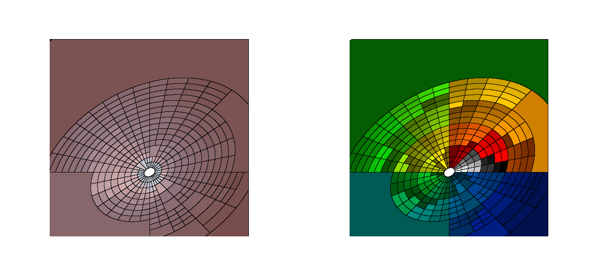
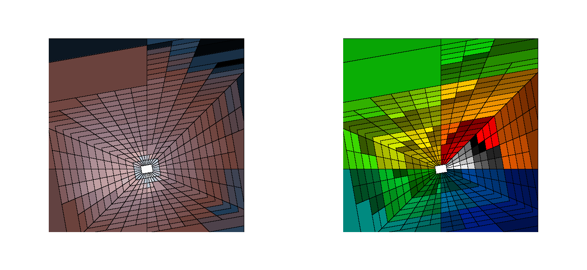
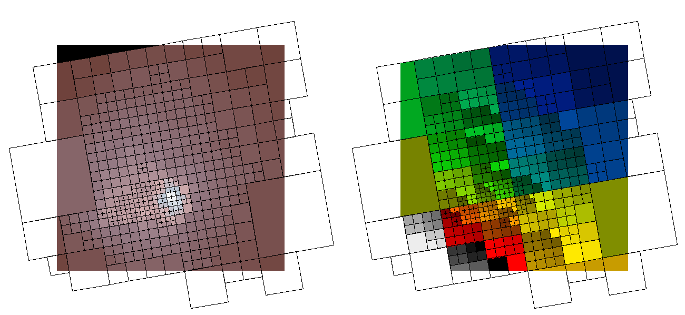

# `dmradar`

This is the polar equivalent of the CIAO 
[`dmnautilus`](https://cxc.cfa.harvard.edu/ciao/ahelp/dmnautilus.html) 
tool.

It works by subdividing the image into 4 pie-shaped wedges and checking
if the SNR in each wedge meets the threshold criteria.  If so, then each wedge
is divided in 4 (radii by 2, angle divided by 2) and the process is repeated.

By default, the wedges are circular: `pie` shapes.  Users can also
use elliptical wedges, `epanda` , or box wedges, `bpanda`.  There is also
a `box` mode which emulates the behavior of the original `dmnautilus` tool.


> **Where does `*panda` come from?**
> 
> `panda` is from `SAOImage ds9`.  It means: _pie and annulus_.

## Examples

### `pie` (default)

The `shape=pie` is the default output shape.

```bash
xcenter=4030.5
ycenter=4223.0
inner_radius=25

punlearn dmradar
dmradar \
  infile=img.fits \
  outfile=dmradar/pie4.abin \
  snr=10 \
  xcen=$xcenter ycen=$ycenter\
  method=4 \
  shape=pie \
  rstart=$inner_radius rstop=1000 \
  outmask=dmradar/pie4.map \
  mode=h clob+
```


This figure shows the output from `dmradar`.  _(Left)_ The adaptively binned
counts image. With `method=4` all 4 pie-slices must meet the `snr=10` threshold
(so all will have at least 100 counts).  _(Right)_ The output map (`outmaskfile`) 
file showing which pixels are grouped together.

The `outmaskfile` contains a `REGION` block containing `pie` shapes which 
are displayed automatically by `ds9`.


### `epanda`


```bash
dmradar \
  infile=img.fits \
  outfile=dmradar/${shape}4.abin \
  snr=10 \
  xcen=$xcenter ycen=$ycenter\
  method=4 \
  shape=${shape} \
  rstart=$inner_radius rstop=1000 \
  outmask=dmradar/${shape}4.map \
  minrad=10 minangl=15 ell=0.7 \
  mode=h clob+
```


| shape     | image                                             |
|-----------|---------------------------------------------------|
| pie       |        |
| epanda    |     |
| bpanda    |     |
| box       |        |


For `epanda` and `bpanda`, the output `REGION` extension contains regions in the form of

    shape_outer * !shape_inner * sector

Three individual shapes, logically ANDed together, to describe each
wedge.


> Note: `ds9` does not recognize `sector` shapes and skips them. Users
> will not see radial lines differentiating the different wedges.
> The above image was created by taking the map file and computing the
> magnitude of the image gradient.  The gradient is 0 inside the wedge, and 
> non-zero when transitioning between wedges. This is then used 
> as a mask when displaying in `ds9`


