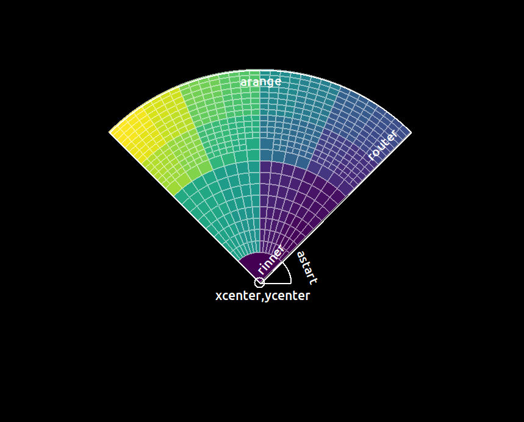
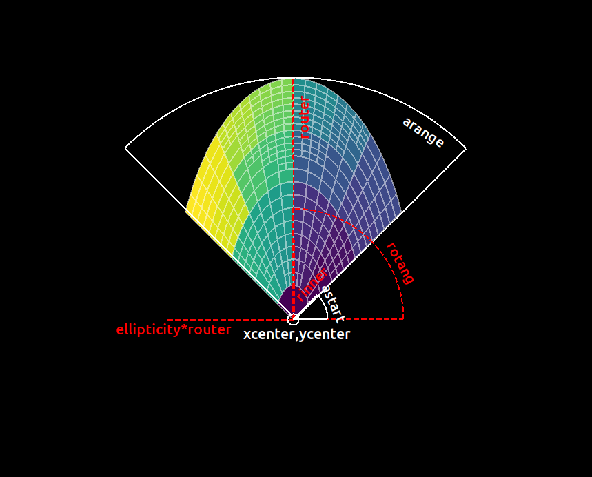
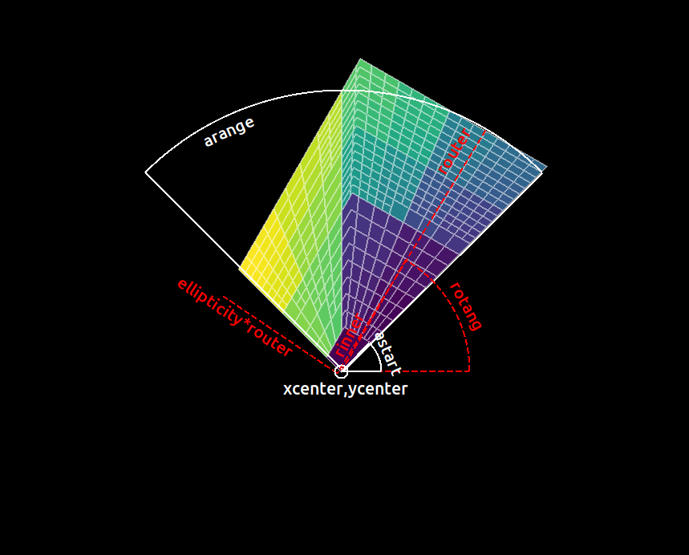

```bash
ciaover -v
```

    # packages in environment at /soft/miniconda/envs/ciao:
    #
    # Name                    Version                   Build  Channel
    ciao                      4.13.0           py38h5ec60c1_0    https://cxc.cfa.harvard.edu/conda/ciao
    ciao-contrib              4.13.0                     py_4    https://cxc.cfa.harvard.edu/conda/ciao
    ds9                       8.2                           2    https://cxc.cfa.harvard.edu/conda/ciao
    sherpa                    4.13.0           py38h5ec60c1_0    https://cxc.cfa.harvard.edu/conda/ciao
    zciao                     4.13.3                        0    https://hea-www.harvard.edu/~kjg/ciao
    
    System information:
    Linux kjg-XPS-8940 5.8.0-41-generic #46~20.04.1-Ubuntu SMP Mon Jan 18 17:52:23 UTC 2021 x86_64 x86_64 x86_64 GNU/Linux


# `dmradar` interface

Document History

- v1: Original draft
- v2: Updated to include `rotang`
- v3: Replace
    - rinner = rinner
    - router = router (technically, rinner+rtart)
    - arange = arange

## Shape parameters

There are 6 parameters for each geometry: `pie`, `epanda`, and `bpanda`:

- `xcenter` and `ycenter` : center of the shape
- `rinner` : the inner radius, often `0` will not be a good choice here.
- `router` : the outer radius, this is the major angle of the ellipse|box.
- `astart` : the starting rotation angle, deg CCW +X axis of the sector to include.
- `arange` : the end angle is `astart+arange`. Defined this way, 
`0<=arange<=360` so no confusion with wrapping around 360.

In addition the `epanda` and `bpanda` shapes use

- `ellipticity` : the minor angle is `ellipticity*(rinner+router)`
- `rotang` : the rotation angle of the shape.

## Translating to CIAO regions.

### `pie` 

There is a simple translation for `pie` regions

    pie(xcenter,ycenter,rinner,router,astart,astart+arange)



```bash
dmradar \
  infile=img.fits \
  outfile=pie.fits \
  outmask=pie.map \
  snr=10 method=4 \
  shape=pie \
  xcenter=4134 ycenter=4153 \
  rinner=100  router=700 \
  astart=45 arange=90 \
  ellipticity=1 \
  rotang=0 \
  minradius=5 minangle=5 \
  mode=h clob+
```

```bash
aconvolve pie.map"[opt type=i4]" pie.grad \
  kernelspec="txt:((0,1,0),(1,-4,1),(0,1,0))" \
  method=slide norm=none edge=const const=0 clob+

ds9 pie.map -cmap viridis -cmap tag load ds9.tag \
  -region delete all -region pie.reg  \
  -mask color white -mask transparency 50 -mask pie.grad 
```

### `epanda` and `bpanda`

There is no single CIAO shape with these parameters.  To express these in 
CIAO syntax we have to use

    SHAPE(outer) & !SHAPE(inner) & SECTOR(start,stop)

to capture the inner radius and the ending angle.

So for example:

    ellipse(xcenter,ycenter,rinner,ellipse*rinner,rotang)
    &!ellipse(xcenter,ycenter,router,ellipse*router,rotang)
    &sector(xcenter,ycenter,astart,astart+arange)

Note: we can omit the `sector` if `arange=360`



```bash
dmradar \
  infile=img.fits \
  outfile=epanda.fits \
  outmask=epanda.map \
  snr=10 method=4 \
  shape=epanda \
  xcenter=4134 ycenter=4153 \
  rinner=100  router=700 \
  astart=45 arange=90 \
  ellipticity=0.5 \
  rotang=90 \
  minradius=5 minangle=5 \
  mode=h clob+
```

```bash
aconvolve epanda.map"[opt type=i4]" epanda.grad \
  kernelspec="txt:((0,1,0),(1,-4,1),(0,1,0))" \
  method=slide norm=none edge=const const=0 clob+

ds9 epanda.map -cmap viridis -cmap tag load ds9.tag \
  -region delete all -region epanda.reg  \
  -mask color white -mask transparency 50 -mask epanda.grad 
```



```bash
dmradar \
  infile=img.fits \
  outfile=bpanda.fits \
  outmask=bpanda.map \
  snr=10 method=4 \
  shape=bpanda \
  xcenter=4134 ycenter=4153 \
  rinner=100  router=700 \
  astart=45 arange=90 \
  ellipticity=0.5 \
  rotang=60 \
  minradius=5 minangle=5 \
  mode=h clob+
```

```bash
aconvolve bpanda.map"[opt type=i4]" bpanda.grad \
  kernelspec="txt:((0,1,0),(1,-4,1),(0,1,0))" \
  method=slide norm=none edge=const const=0 clob+

ds9 bpanda.map -cmap viridis -cmap tag load ds9.tag \
  -region delete all -region bpanda.reg  \
  -mask color white -mask transparency 50 -mask bpanda.grad 
```

## `ds9` regions

Each of these shapes can be expressed in ds9 as a `panda` shape

    [eb]panda(xcenter,ycenter,astart[-rotang],astart+arange[-rotang],1,rinner,router,1[,rotang])

### Note: 

- CIAO does not understand `panda` shapes.  Thus the 
[convert_ds9_region_to_ciao_stack](https://cxc.cfa.harvard.edu/ciao/ahelp/convert_ds9_region_to_ciao_stack.html)
script.
- The `1`'s are required to specify that there is only 1 set of
angles and only 1 set of radii.
- The order of specifying radii and angles is switched from say the CIAO `pie`
shape.
- _TODO_ check whether there is a factor of 2|0.5 for the `bpanda` (radii vs. length).
- ds9 measures the starting and ending angles relative to the rotation angle, not to +X.

## Thoughts/Opinions

~~Since we cannot express all the shapes using simple CIAO region syntax, the
we should not do something special just for `pie`.~~

~~Inventing a new syntax for an elliptical annulus and box annulus specific to
just this tool -- which neither CIAO nor ds9 can use -- is a bad idea.  
See dmextract only 'annulus' and aconvole kernelspec.~~

~~The major axis = `rinner+router` I can see as confusing.  We could either 
rename the parameter `rrange` or redefine it in the code such that the range
is `router-rinner`. Note: defined as range, we do not have to worry
about `router < rinner` as long as we restrict `rrange>0` (which parameter
interface does for us).~~

~~Similarly for the end angle = `astart+arange`.  Though in this case I would 
advocate more strongly for renaming the parameter to be `arange` due
to the confusion eg if `astart==arange`, then presumably you'd 
meant to specify 360degs ; though less clear when you specify 
`arange < astart` then it becomes unclear if area included goes
clock-wise or counter-clock wise.~~

KJG and JCM met on 05 Feb 20201: Decided to rename 
- `rstart` to be `rinner`
- `rstop` to be `router`, The code will compute the delta_r= router-rinner.
- `astop` to be `arange`.  


```bash

```
